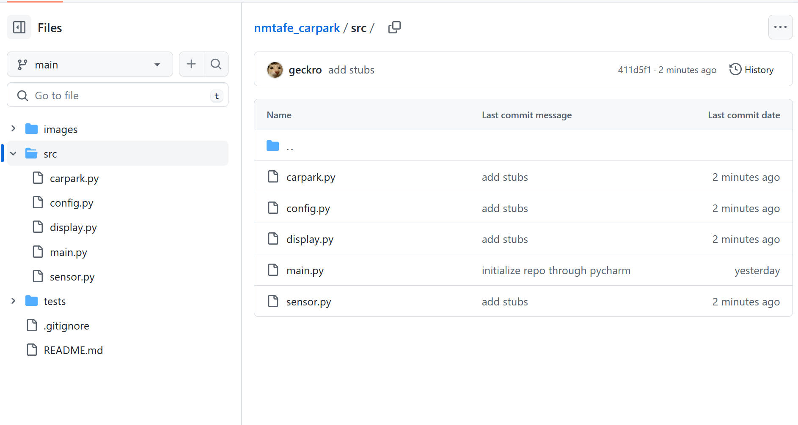
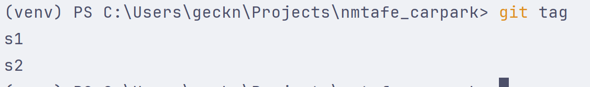
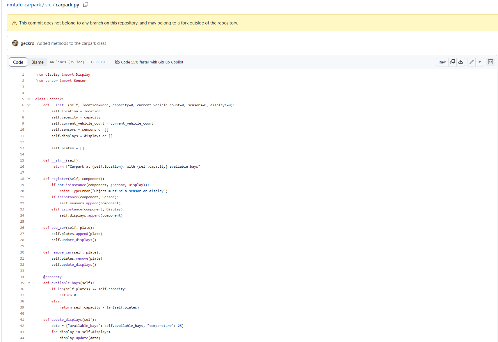
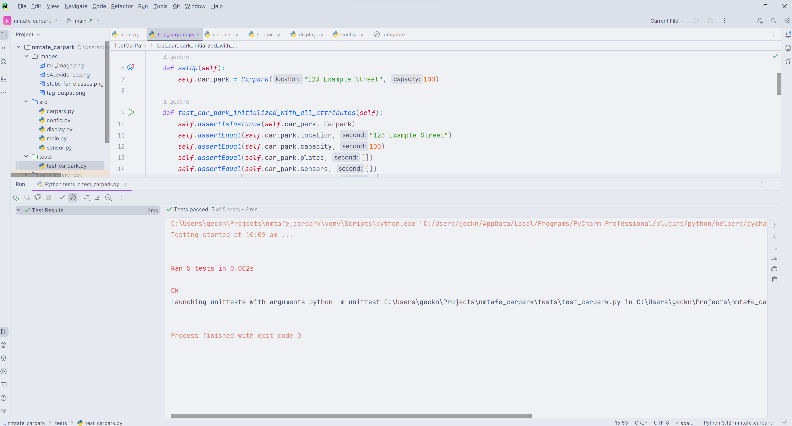
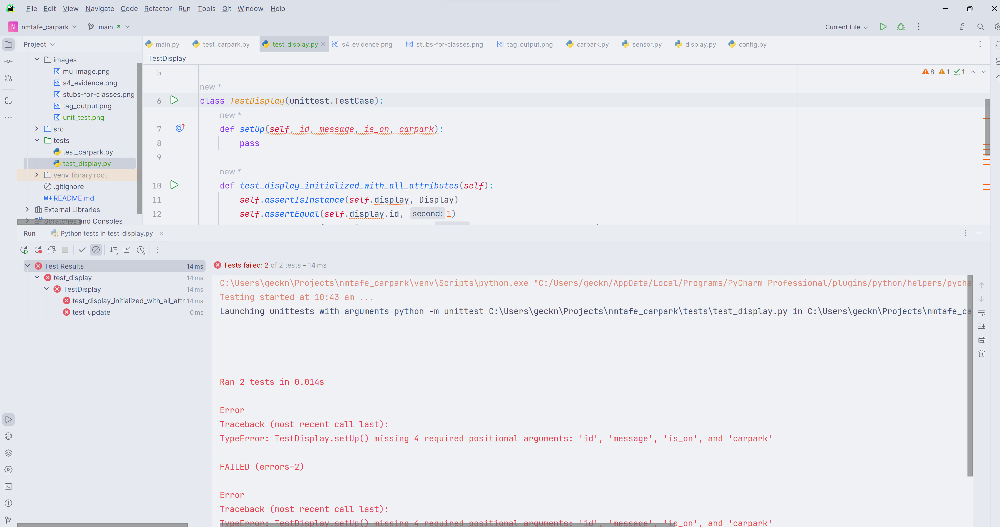
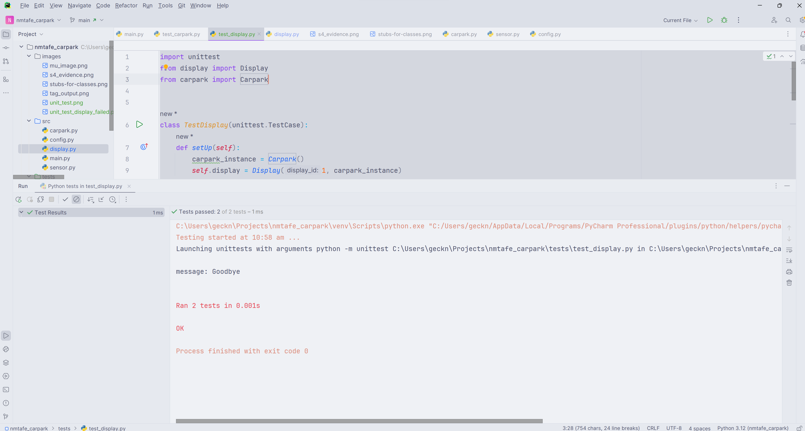

# NM-TAFE Carpark Assessment

| Class Name | Attributes                                                          | Methods                                         |
|------------|---------------------------------------------------------------------|-------------------------------------------------|
| Carpark    | location capacity current_vehicles sensors displays | add_car() update_display() remove_car() |
| Sensor     | sensor_id is_active carpark                                 | update_carpark() __str__()                  |
| Display    | display_id carpark message is_on                        | __str__() update()                          |

**1. Which class is responsible for each of the following pieces of information (and why)?**  
**a) The number of available bays**  
Carpark - with capacity attribute, and available_bays()    
**b) The current temperature**  
Carpark - static integer in update_displays()  
**c) The time**  
Sensor - There is no time attribute or variable anywhere but sensor_id and is_active is close enough  
**2. What is the difference between an attribute and a property?**  
Attributes are just members of an object, while properties are methods that are accessed like attributes.  
**3. Why do you think we used a dictionary to hold the data we passed the display? List at least one advantage and one disadvantage of this approach**  
A dictionary reduces the attributes needed to pass to the display and provides a structured format.  
But in order to use a dictionary, you will need to pack it into a dict, pass it to the new method and then unpack it and get values of the keys, which is slower and uses more computation power.  

