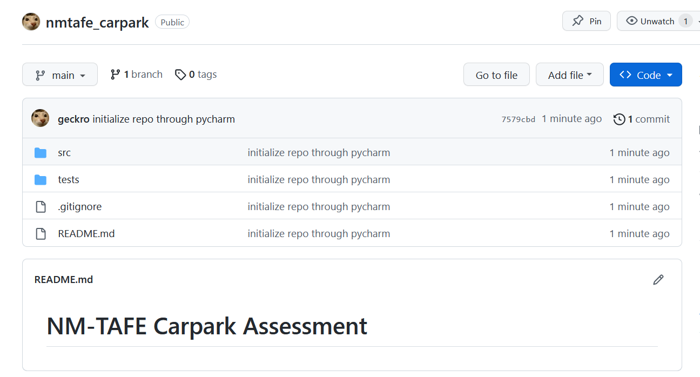

# NM-TAFE Carpark Assessment

| Class Name | Attributes                               | Methods                                     |
|------------|------------------------------------------|---------------------------------------------|
| Carpark    | location current_vehicles Sensor | increment_count() update_display()      |
| Sensor     |                                          | activate_sensor() detect_car_presence() |
| Display    |                                          | display_available_num_bays()                |
| Config     |                                          |                                             |